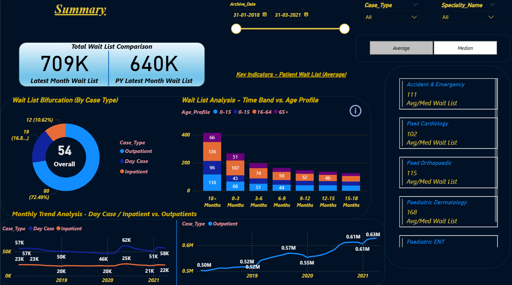

# 🏥 Power BI Healthcare Dashboard  

  
  
  
  

---

## 📖 Overview  
This repository contains an interactive **Power BI dashboard** designed for **Healthcare Data Analysis**.  
It provides insights into patient demographics, hospital resource utilization, and treatment outcomes.  

---

## 📂 Files in this Repo  
- **HealthcareDashboard.pbix** → Original Power BI file (open with Power BI Desktop).  
- **HealthcareDashboard.pdf** → Exported PDF version for quick preview.  
- **Screenshot.png** → Dashboard preview image.  

---

## 📊 Dashboard Insights  
- 👨‍⚕️ Patient statistics and demographics  
- 💉 Treatment outcomes and performance metrics  
- 🏥 Hospital resource utilization  
- 📈 Trends in admissions and discharges  

---

## 🔗 How to Use  
1. Download the `.pbix` file.  
2. Open it in **Power BI Desktop** to explore interactively.  
3. Or, simply check the **PDF** for a static snapshot.  

---

## 📸 Preview  
  

---

## 🛠 Tech Stack  
- **Power BI Desktop**  
- **GitHub** for version control  

---

## ✨ Author  
👨‍💻 Created by **[Mayur Labade](https://github.com/MayurLabade)**  
📧 Contact: [mayurkumar3366@gmail.com](mailto:mayurkumar3366@gmail.com)  
🔗 [LinkedIn](https://linkedin.com/in/mayur-labade-b336b5328) | [GitHub](https://github.com/MayurLabade)  

---
